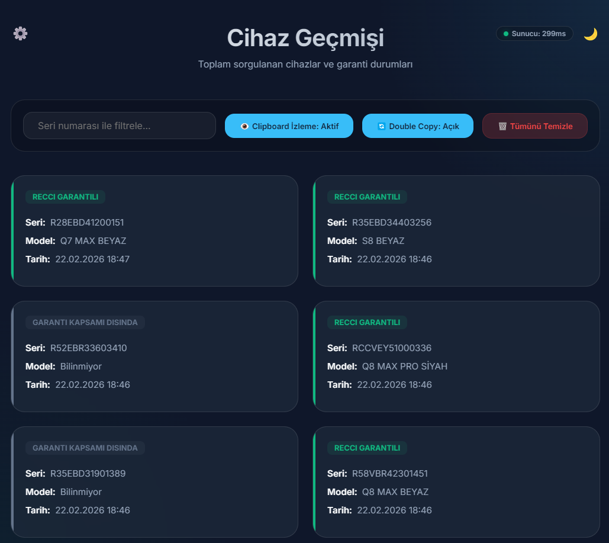
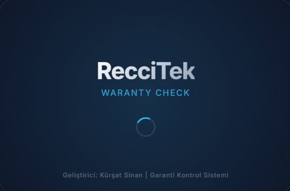
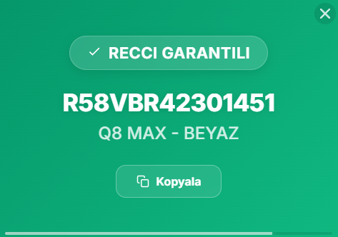
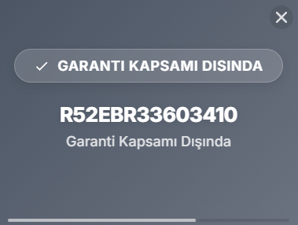
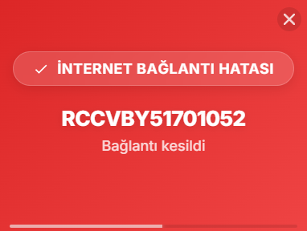

# 🚀 RecciTek WCheck

[](https://github.com/KursatS/RecciTek-WCheck)
[](LICENSE)
[](https://electronjs.org)
[](https://vitejs.dev)
[](https://www.typescriptlang.org)

**RecciTek WCheck** — Gelişmiş Garanti Takip, Cihaz Çağrı ve Servis Analiz Sistemi. Panodan kopyalanan seri numaralarını anında algılar, Recci & KVK servis sunucularından garanti durumunu sorgular, canlı öncelikli cihaz takibi sağlar ve detaylı Z Raporu analizleri sunar.

---

## 🖼️ Ekran Görüntüleri

### Ana Panel & Açılış
| Ana Sayfa | Açılış Ekranı (Splash) |
| :---: | :---: |
|  |  |

### Akıllı Durum Bildirimleri (Popups)
| Garanti Kapsamında | Garanti Dışı / Fatura Kontrol | Bağlantı Sorunu |
| :---: | :---: | :---: |
|  |  |  |

---

## ✨ Güncel Özellikler (v2.5.6)

- ⚡ **Akıllı Panodan Garanti Sorgulama**: Seri numaralarını panodan kopyaladığınız anda anında algılar. Özel hafif Regex HTML parser ile Recci ve KVK servis verilerini milisaniyeler içinde ekrana getirir.
- 🏷️ **Recci İthalat & Fatura Kontrol Rozeti**: Türkiye garantili olup sistemde süresi dolmuş görünen cihazlar için canlı yeşil `✓ RECCI GARANTİLİ` ve turuncu `(SÜRESİ DOLMUŞ - FATURA KONTROL)` akıllı rozet gösterimi.
- 🔠 **AHK Tarzı "Büyük Harf Yapıştır" (Ctrl+Shift+V)**: Panodaki metinleri Türkçe karakter uyumlu olarak otomatik büyük harfe dönüştürüp hızlıca yapıştırma imkanı.
- 📢 **Canlı Cihaz Çağrı (Cihaz Sor) Sistemi**: Kargo kabul ve servis personeli arasında anlık cihaz sorgulama, canlı yanıt takibi ve Web Audio API tabanlı pürüzsüz bildirim sesleri (`Chime / Pop`).
- ⚠️ **Öncelikli Cihaz Takip Sistemi**: Acil takibe alınan cihazları Firestore veritabanı üzerinden tarih/saat damgasıyla canlı senkronize etme ve masaüstü popup bildirimleri fırlatma.
- 📝 **Excel Z Raporu Analizi**: Servis kayıt dosyalarını sürükle-bırak yöntemiyle inceleme; en son 5 güne ait toplam kayıt sayılarını, model dağılımlarını ve personel bazlı çalışma adetlerini grafiksel görselleştirme.

---

## 🛠️ Kurulum & Derleme

### Gereksinimler
- Node.js 18+
- npm

### Geliştirici Adımları
```bash
# Bağımlılıkları yükleyin
npm install

# Geliştirici modunda çalıştırın (Dev Mode)
npm run dev

# Projeyi derleyin (Build)
npm run build
```

### Setup / Windows Kurulum (.exe) Dosyası Oluşturma
Uygulamanın Windows kurulum (NSIS `.exe`) paketini oluşturmak için:
```bash
npm run dist
```
Oluşturulan kurulum dosyası `release/` klasörü altına kaydedilecektir.

---

## 🎯 Kullanım

1. **Seri Numarası Kopyalayın**: Panoya seri numarasını kopyaladığınız an sistem otomatik olarak garanti durumunu sorgular.
2. **Popup'ı İnceleyin**: Ekranın sağ alt köşesinde beliren renk kodlu (Yeşil: RECCI, Mavi: KVK, Gri/Turuncu: Fatura Kontrol) masaüstü popup'ı ile durumu anında görün.
3. **Cihaz Çağrısı Atın**: Kargo kabul personelinden "Cihaz Sor" sekmesiyle anlık cihaz bulunma çağrısı yapın.
4. **Z Raporu Yükleyin**: Servis Excel dosyanızı sürükleyip bırakarak günlük personel ve model istatistiklerini raporlayın.

---

## 📁 Dosya Yapısı

```
RecciTek-WCheck/
├── assets/                 # Logolar, ikonlar ve ekran görüntüleri
├── src/                    # Kaynak kodları (TypeScript)
│   ├── main.ts            # Ana Electron süreci & IPC İşleyicileri
│   ├── windowManager.ts   # Pencere, Popup & Tray Yönetimi
│   ├── settingsManager.ts # Ayar & Persistence Yönetimi
│   ├── warrantyChecker.ts # Recci & KVK Garanti Scraper
│   ├── cacheManager.ts    # SQLite Veritabanı (better-sqlite3)
│   ├── ticketService.ts   # Firestore Entegrasyonu & Öncelikli Cihazlar
│   ├── utils/             # Yardımcı Mantık Kütüphaneleri (Z-Report, Debounce, Toast)
│   └── *.html             # Modern UI Arayüz Dosyaları
├── release/               # Derlenen kurulum (.exe) dosyaları
├── package.json           # Proje paketleri, bağımlılıklar ve versiyon
└── README.md              # Kullanım ve Teknik Dokümantasyon
```

---

## 👨‍💻 Geliştirici

**Kürşat Sinan**
- GitHub: [@KursatS](https://github.com/KursatS)
- Proje: [RecciTek-WCheck](https://github.com/KursatS/RecciTek-WCheck)

---

⭐ Eğer bu proje işinizi kolaylaştırdıysa, GitHub üzerinden yıldız vermeyi unutmayın!
